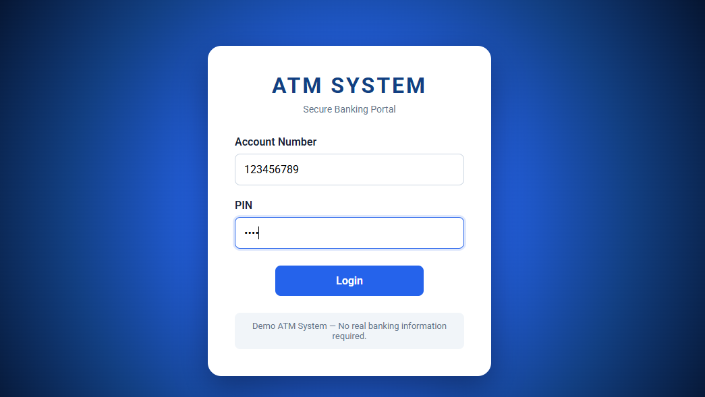
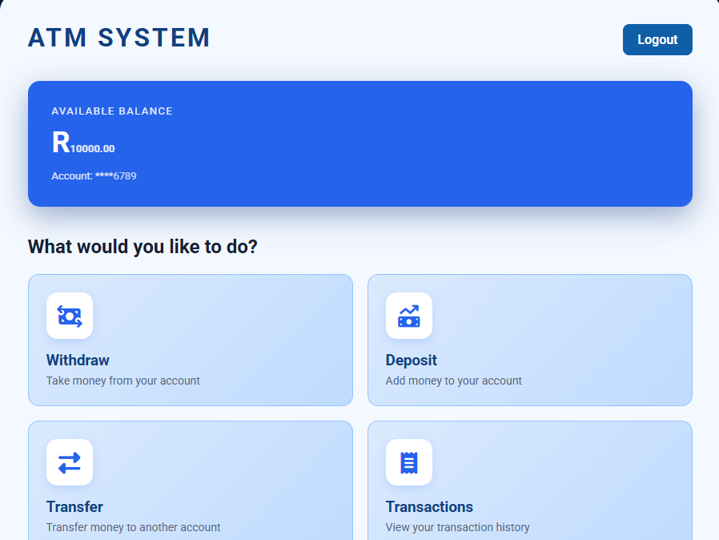
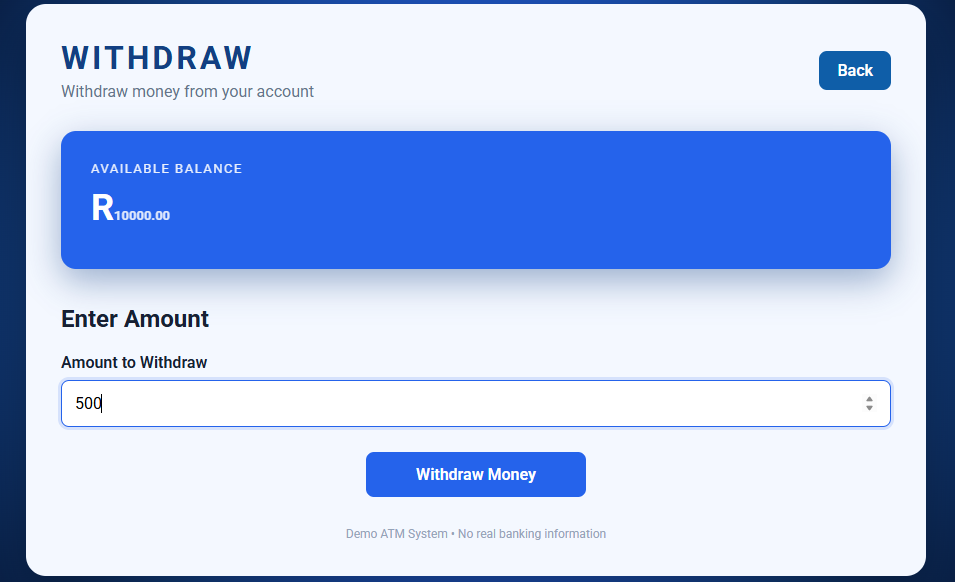
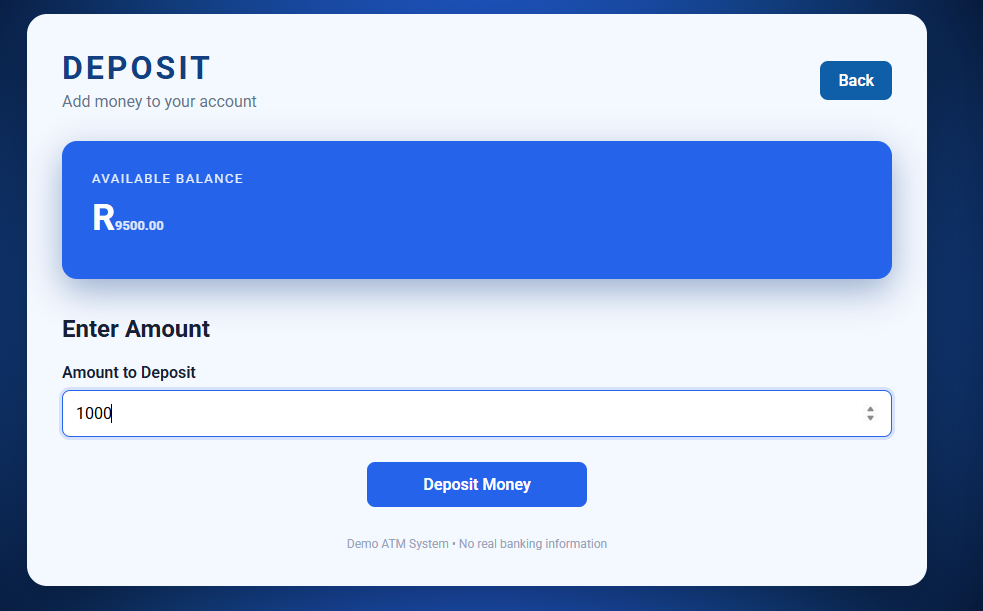
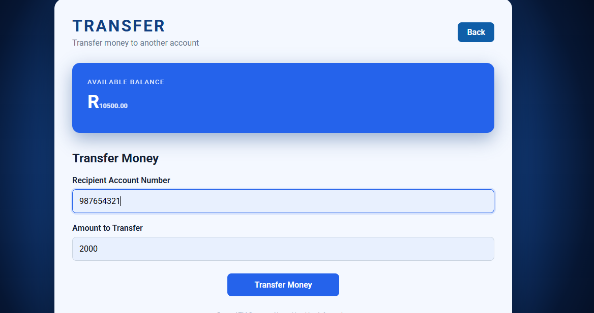
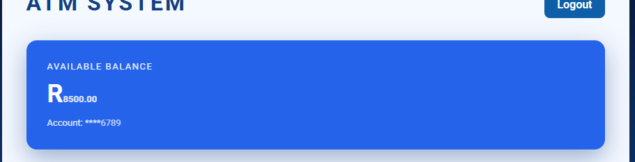

ATM System- A Java-based ATM web application created to demonstrate my understanding of Java and basic web application development.

Features
* User login and authentication
* Checking an account balance
* Withdrawing money
* Depositing money
* Viewing transaction information
* Input validation and error handling
* Logging out of the application

Technologies Used
* Java
* Spring Boot
* Maven
* HTML
* CSS

-Screenshots

Login

Main Menu

Withdraw

Deposit

Transfer

Running the Application
The application can be run locally using IntelliJ IDEA.

1. Clone or download the repository.
2. Open the project in IntelliJ IDEA.
3. Allow Maven to download and load the required dependencies.
4. Run the Spring Boot application.
5. Open the local address shown when the application starts.

About the Project- I created this project as a practical way to work with Java and Spring Boot while building something that simulates the basic functions of an ATM. It allowed me to work with application logic, user input, validation, and different transactions in a web-based application.

Developer- Janelle Labuschagne

